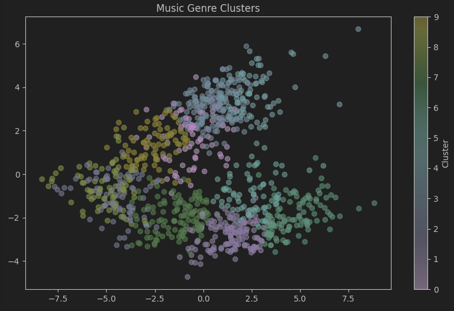

# Music-Genre-Classification
This repository contains a [Jupyter](https://jupyter.org/) Notebook With the means to run a machine learning script to predict classify genres of music, using an audio file

**Data**
the data was recieved from [GTZAN Dataset - Kaggle](https://www.kaggle.com/datasets/andradaolteanu/gtzan-dataset-music-genre-classification) which gives a data set of which the following columns where used:
- **filename:** the file name is used to navigate to the .wav file in the data folder
- **label:** this column has the label of the genre of music (rock, jazz, etc.)

The data is taken in using pandas and stored in a variable

the genres are as follows:
- blues
- classical
- country
- disco
- hiphop
- jazz
- metal
- pop
- reggae
- rock

**Pre-Processing**

The audio files are then processed and split into subsections of easily workable data:
- Tempo: speed of the song in Beats Per Minute
- MFCCs: Gets characteristics of the audio (instruments)
- Chroma: Pitch
- Spectral Centroid: Brightness of the sound
- Zero-Crossing Rate: Noisiness of the sound
- RMS Energy: Loudness or intensity of the audio

The data for Chroma and MFCC is then combined into one element on the data frame
and a feature matrix is created for the above elements

K-Means clustering is then applied to the data frame by splitting the 10 categories into 10 clusters

the clusters are then visualized using the below graph
